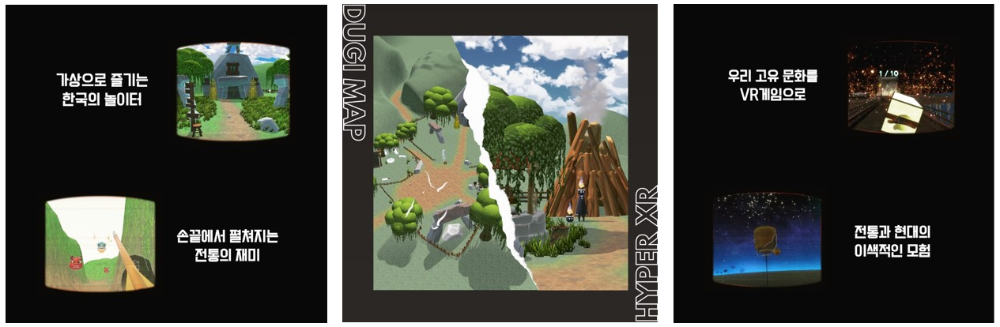

# 🏹 DugiXR

## 💡 Project Overview
### About Project
`DugiXR` takes its name from the Korean word “kkakdugi”, which was traditionally used to describe someone inexperienced in a game and unable to fully participate. This is a single-player experience set in a traditional game village, where players engage in various Korean traditional games and complete challenges. The games featured in Dugi XR are modern reinterpretations of traditional Korean pastimes, including Tuho (arrow-throwing game), Jegichagi (shuttlecock kicking), Nakhwa-nori (falling flower play), and Jwibul-nori (fire-spinning game).
### Project Objective
`DugiXR` is a project that aims to create a new form of entertainment experience by blending modern technology with Korean tradition. Utilizing spatial computing, passthrough, and hand-tracking technology of the Meta Quest 3, it reinterprets traditional Korean games in a modern way, allowing users to experience them in virtual reality. Through this, the project seeks to introduce the charm of Korean culture to users worldwide.

## 🛠️ Stacks
### 🌍 Environment
- **Game Engine** : Unity 3D
- **XR Framework** : OpenXR
- **Language** : C#
### 🎨 Art & Design
- **3D Modeling & Animation** : Blender
- **Textures & Materials** : Substance Painter, Photoshop
### 🕹️ XR & Hardware
- **VR Headset** : Meta Quest 3
- **Hand Tracking & Spatial Computing** : Meta Quest SDK
### 🗂️ Project Management
- **Version Control** : Unity Version Control
- **Communication** : Slack, Discord

## 🎯 Required Skills

  
Hand Tracking with Unity XR Interaction Toolkit (Main Skill)

  Unity XR Interaction Toolkit for hand tracking is a technology used in VR and AR projects to track and interact with the user's hands in real-time using Unity. This technology integrates with Unity's XR platform, allowing users to perform various interactions such as selecting, dragging, and dropping objects within a virtual environment using their hands. It provides the following features:
  - **Hand Tracking**: Accurately tracks the user's hands and reflects real-world hand movements within the virtual environment.
  - **Interaction**: Enables users to touch, grab, and throw virtual objects using their hands for seamless interaction within the virtual environment.
  - **Event System**: Executes game logic and processes interaction outcomes in response to user interactions.
  - **Cross-Platform Support**: Provides compatibility with various VR and AR platforms, allowing use on multiple devices and headsets.
  - **Customizable Features**: Offers extensibility, allowing developers to freely customize game logic and interaction styles.

### LiDAR(Light Detection and Ranging)
LiDAR is a technology that uses laser beams to measure the distance and shape of the surrounding environment. This technology plays a crucial role in augmented reality (AR) and virtual reality (VR) applications. It is primarily integrated into modern mobile devices and AR headsets, serving as a powerful tool for AR game developers. LiDAR can be integrated into AR games in the following ways:
- Environmental Awareness: LiDAR can accurately measure the spatial structure of the surrounding environment. In AR games, it is used to recognize the player's real-world surroundings in real-time and reflect them in the game world.
- Obstacle Detection and Interaction: LiDAR can precisely measure the distance to surrounding objects, making it useful for developing AR games where players interact with real-world objects. It allows players to avoid obstacles or collide virtual objects with real-world objects.
- Background and Environment Enhancement: The data can be used to improve the visual quality of the surrounding environment. It can enhance the game's graphical effects or help integrate virtual characters more naturally with the real-world environment.

## 📄 Documents
- [DugiXR Project Plan](./DugiXR_PDF/DugiXR_프로젝트기획안-압축됨.pdf)
- [Development Roadmap](./DugiXR_PDF/다은_개발로드맵.pdf)
- [Project Progress & Meeting Notes](./DugiXR_PDF/DugiXR_진행과정.pdf)

## 🎮 InGame Video

## 📥 Final Deliverable
You can download the final deliverable from the following link: [Download Final Deliverable](https://bit.ly/DugiXR)
