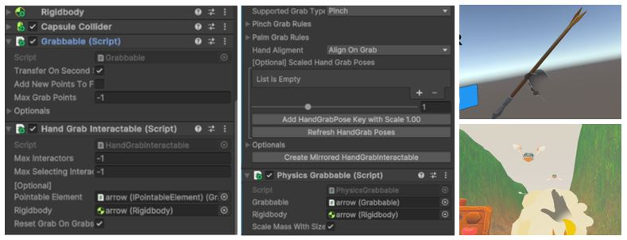

# 🏹 DugiXR

## 💡 Project Overview
### About Project
`DugiXR` takes its name from the Korean word “kkakdugi”, which was traditionally used to describe someone inexperienced in a game and unable to fully participate. This is a single-player experience set in a traditional game village, where players engage in various Korean traditional games and complete challenges. The games featured in Dugi XR are modern reinterpretations of traditional Korean pastimes, including Tuho (arrow-throwing game), Jegichagi (shuttlecock kicking), Nakhwa-nori (falling flower play), and Jwibul-nori (fire-spinning game).
### Project Objective
`DugiXR` is a project that aims to create a new form of entertainment experience by blending modern technology with Korean tradition. Utilizing spatial computing, passthrough, and hand-tracking technology of the Meta Quest 3, it reinterprets traditional Korean games in a modern way, allowing users to experience them in virtual reality. Through this, the project seeks to introduce the charm of Korean culture to users worldwide.

## 🛠️ Stacks
### 🌍 Environment
- **Game Engine** : Unity 3D
- **XR Framework** : OpenXR
- **Language** : C#
### 🎨 Art & Design
- **3D Modeling & Animation** : Blender
- **Textures & Materials** : Substance Painter, Photoshop
### 🕹️ XR & Hardware
- **VR Headset** : Meta Quest 3
- **Hand Tracking & Spatial Computing** : Meta Quest SDK
### 🗂️ Project Management
- **Version Control** : Unity Version Control
- **Communication** : Slack, Discord

## 🎯 Required Skills

<h3>Hand Tracking with Unity XR Interaction Toolkit (Main Skill)</h3>

Unity XR Interaction Toolkit for hand tracking is a technology used in VR and AR projects to track and interact with the user's hands in real-time using Unity. This technology integrates with Unity's XR platform, allowing users to perform various interactions such as selecting, dragging, and dropping objects within a virtual environment using their hands. It provides the following features:

  - **Hand Tracking**: Accurately tracks the user's hands and reflects real-world hand movements within the virtual environment.  
  - **Interaction**: Enables users to touch, grab, and throw virtual objects using their hands for seamless interaction within the virtual environment.  
  - **Event System**: Executes game logic and processes interaction outcomes in response to user interactions.  
  - **Cross-Platform Support**: Provides compatibility with various VR and AR platforms, allowing use on multiple devices and headsets.  
  - **Customizable Features**: Offers extensibility, allowing developers to freely customize game logic and interaction styles.  

<h3>LiDAR (Light Detection and Ranging)</h3>

LiDAR is a technology that uses laser beams to measure the distance and shape of the surrounding environment. This technology plays a crucial role in augmented reality (AR) and virtual reality (VR) applications. It is primarily integrated into modern mobile devices and AR headsets, serving as a powerful tool for AR game developers.

**LiDAR can be integrated into AR games in the following ways:**

- **Environmental Awareness**: LiDAR can accurately measure the spatial structure of the surrounding environment. In AR games, it is used to recognize the player's real-world surroundings in real-time and reflect them in the game world.  
- **Obstacle Detection and Interaction**: LiDAR can precisely measure the distance to surrounding objects, making it useful for developing AR games where players interact with real-world objects. It allows players to avoid obstacles or collide virtual objects with real-world objects.  
- **Background and Environment Enhancement**: The data can be used to improve the visual quality of the surrounding environment. It can enhance the game's graphical effects or help integrate virtual characters more naturally with the real-world environment.  

<h3>Pass-through</h3>

Pass-through refers to enabling users to view their surrounding real-world environment through a device. It is mainly utilized in AR and VR headsets by using cameras to capture and display the real world. This technology can be integrated into games in the following ways:

  - **Real-World Integration**: Allows users to continuously see the real world. Virtual characters or objects can appear while the user views their surroundings.
  - **Enhanced Reality Experience**: Provides experiences such as allowing users to move to different locations within a physical space.  
  - **Interaction**: Enables users to interact with physical objects in their environment. Elements involving physical objects can be added to the gameplay.
  - **User Safety and Convenience**: Can include warning features to prevent users from colliding with real-world objects, or visually provide helpful information for user convenience.

**Test Video**:

      
    

## 🎬 Scene Overview
### 🏘️ Main Village
The Main Village is the starting point of the game, where players are introduced to each game’s concept and the story unfolds.  
Take a look at the *in-game footage* below!

### 🏸 제기차기 Jegichagi
**Overview**  
*Jegichagi* is a traditional game with simple mechanics but hidden potential for diverse interpretations. We believed that XR technology could further expand its possibilities. Originally, *Jegichagi* is a traditional game where players kick a shuttlecock-like object with their feet to keep it from falling. However, to utilize *hand tracking*, we modified the gameplay to use hands instead of feet.

**Physics Applied to the Jegi Object**  
The force applied to the jegi is determined based on the direction of the user's hand when hitting it, allowing for control over its movement.  
In the prototype, for simplicity and testing purposes, the score was fixed and the jegi object was restricted to move only along the Y-axis.  
You can refer to `SetCenterOfMass.cs` for the implementation details of this feature.

### 🏮 낙화놀이 Nakhwa-nori
**Overview**  
*Nakhwa-nori* is a traditional fire play typically experienced only during special festivals or events. This project aims to make it accessible on a personal level through XR technology. In the XR version of *Nakhwa-nori*, users can write wishes on a piece of paper, send it off on a virtual lantern, and experience the beauty of falling embers in a simulated environment.

**Movement Based on Hand Direction**  
By using hand tracking, players can grab the *Nakhwa* lantern and move in the direction their hand is pointing, allowing them to navigate freely to their desired location within the virtual space.  
You can refer to `HandLightManager.cs` for the implementation details of this feature.

### 🏹 투호놀이 Tuho
**Overview**  
*Tuho* is a traditional Korean game with strong potential to be transformed into a more dynamic and interactive experience when combined with modern technology.  
In this XR-based version, players engage in a *Tuho* battle against virtual monsters, allowing them to interact with digital elements in their physical space and enjoy a new type of immersive gameplay.

**Grabbing Mechanics**  
Hand tracking support allows the system to recognize precise finger movements, enabling users to perform natural grabbing gestures.  
To implement this, components provided by Oculus Integration were used to detect the grabbing motion, and the `PhysicsGrabbable` component was added to handle realistic grabbing and throwing interactions with the *Tuho* stick.

### 🔥 쥐불놀이 & 달집 태우기 Jwilbulnori & Daljip Burning
**Overview**  
*Jwibulnori* and *Daljip Burning* are traditional Korean fire-related rituals. However, due to safety concerns, they are not easily performed in real life today. This project was designed to recreate both experiences in a modern and safe way using XR technology.  
The game combines the fire-spinning mechanic of *Jwibulnori* with the symbolic burning of the *Daljip* (moon house), offering users an immersive and culturally rich virtual experience.

**Spinning Fire Can**  
By grabbing the fireball with hand tracking, the rotation speed is determined by the intensity of the user's hand movement.  
Faster hand motions cause the fireball to spin more rapidly, while slower movements gradually reduce the spinning speed.  
You can refer to `CanRotation.cs` for the implementation details of this feature.

## 💣 Troubleshooting
---
### 1️⃣ **Hand Tracking for Object Interaction**

When implementing **object interaction** using **hand tracking** in VR, the primary issue was the **lack of references** and resources for accurately handling hand gestures for grabbing and throwing objects. Unlike traditional VR controller-based grabbing, hand tracking involves more complex interactions, requiring precise adjustments to the various **Oculus Integration components**.

#### **Issues Encountered**
---
- **Instability of Hand Tracking**:  
  Hand tracking was often inaccurate, especially with **subtle or fast hand movements**, resulting in **incorrect object interactions** like failing to grab or throwing objects in unintended directions.
- **Challenges with Physical Interactions**:  
  When trying to grab and throw an object, it was important that the **object responded physically** based on hand movement. The challenge was to **simulate realistic forces and trajectories**, especially when tracking the force and direction of the hand to produce a natural throw.
- **Difficulty in Configuring Components**:  
  Using multiple components such as **Grabbable, Hand Grab Interactable**, and **Physics Grabbable** required precise tuning. Ensuring these components worked well together, while maintaining accurate interaction and physical responses, was a complex task.

---
### **Solution Approach**
---

1. **Improving Hand Tracking Accuracy**:  
   To enhance hand tracking accuracy, several optimization techniques were implemented:
   - **Movement filtering** algorithms were applied to **stabilize the hand’s tracking**, particularly during rapid or subtle movements.
   - **Hand position prediction** was introduced to **improve accuracy** when the hand moved too fast, allowing more reliable tracking even in fast gestures.

2. **Configuring Grabbable, Hand Grab Interactable, and Physics Grabbable Components**:  
   Each of these components had to be fine-tuned for precise interactions:
   - Grabbable: This component is used to make objects **grabbable**. In hand tracking scenarios, this is essential to ensure that objects are **properly detected** and handled by the hand. We used **XR Grab Interactable** to manage the grabbing process, and **adjusted its settings** to ensure that objects respond correctly to hand gestures.
   - **Hand Grab Interactable**: This component allows the hand to directly interact with the object. By adjusting the **hand tracking** to match the **hand’s shape and position**, we ensured that the interaction felt **natural**. This required syncing the hand's **position** and **rotation** with the object's transformation.
   - **Physics Grabbable**: To allow for **physical interactions** with the object, **Physics Grabbable** was essential. When using physics, we applied realistic **forces** and **velocities** based on the hand's movements to ensure that objects behave naturally when grabbed or thrown. We adjusted the **mass**, **drag**, and **angular drag** properties to make the objects behave more realistically in the VR environment.
     

3. **Detailed Configuration Process**:  
   - **Synchronizing Hand Position and Rotation**:  
    Hand tracking required constant synchronization of **hand position** and **rotation** with the object’s movement. We used **XR Controller** to sync these values and adjusted the **tracking offsets** to ensure objects aligned with hand gestures.
   - **Adjusting Physical Interactions**:  
    The **speed**, **direction**, and **force** of the hand were crucial for determining how the object would react. By using **Unity’s physics engine** and adjusting the object’s response to hand movements, we ensured that the object **moved in a realistic and responsive manner**, accurately reflecting the hand’s motion.
   - **Debugging and Tuning**:
    We continually refined the interaction system through **testing and iterative adjustments**. By monitoring how the object behaved during interaction, we fine-tuned its response to ensure consistent, **realistic behavior** during both grabbing and throwing.
---
### **Conclusion**
---
By implementing the above optimizations and configuring the **Grabbable**, **Hand Grab Interactable**, and **Physics Grabbable** components correctly, we were able to resolve the issues with **hand tracking and physical interaction**. The final solution allowed for a more **accurate and natural** grabbing and throwing experience, leveraging **Oculus Integration** and the **XR Interaction Toolkit**.  
This approach greatly improved **hand-tracked object interactions** by ensuring more **stable and predictable behavior** in the VR environment.

---
---
### 2️⃣ **VR Optimization Issues in Unity**

During the development of the VR project, several performance-related issues emerged that hindered the overall gameplay experience, particularly when testing on different VR headsets. The key issues were:
- **Low Frame Rates**: Frame rate drops occurred when rendering complex VR scenes, especially in environments with numerous interactable objects or physics-based interactions. These drops were particularly noticeable in high-performance scenarios like **real-time physics calculations** and complex animations.
- **Render Performance**: Significant issues arose with **GPU load** and **overdraw**, causing **lag** and **stuttering** in the VR environment. With the heavy visual requirements of VR, every frame needs to be rendered smoothly to avoid motion sickness or discomfort.
- **Physics Overhead**: The **physics engine** consumed a significant amount of processing power, especially when interacting with **multiple moving objects** in the scene. This led to inconsistent and sluggish behavior when objects were grabbed, thrown, or interacted with dynamically.

---
### **Solution Approach**
---

1. **Optimizing Frame Rates and Rendering Performance**:  
   - **Reducing Overdraw**:  
   To minimize the load on the GPU, we tackled **overdraw** by simplifying shaders and using **occlusion culling** to avoid rendering objects that were off-screen or hidden behind other objects. This helped reduce the number of pixels being rendered and made the game run more smoothly.  
  Image: Unity Profiler showing the reduction of overdraw in VR scene for improved GPU performance.
   - **Reducing Draw Calls**:
   A major performance bottleneck was **too many draw calls** per frame. To optimize this, we implemented **GPU instancing** to render multiple instances of the same object using a single draw call. Additionally, we utilized **texture atlases** to combine multiple textures into one, which significantly reduced material switches and draw calls.  
  Image: Before and after optimization showing reduced draw calls and improved performance.    

2. **Physics Optimization**:  
   - **Simplifying Colliders**:  
   Using **mesh colliders** was one of the major performance issues. These were replaced with simpler **box colliders**, **capsule colliders**, or **sphere colliders**, which reduced the computational cost of collision detection.  
   - **Optimizing Rigidbody Interactions**:  
   For moving objects, such as those used for **grabbing and throwing**, we optimized the way **forces** were applied. By using **discrete collision detection** instead of **continuous**, we reduced the computational cost of simulating fast-moving objects, which helped improve performance.

3. **Optimizing VR Input Handling**:  
   - **Reducing Input Polling**:  
   Constantly polling VR input devices can have a significant performance cost, especially on lower-end devices. To optimize this, we reduced the frequency of input polling and only updated the input states when **necessary**, such as when an interaction like grabbing or pressing occurred.
   - **Hand Tracking Optimization**:  
   **Hand tracking** is a powerful feature, but it can be resource-intensive. To optimize, we updated hand tracking at a **lower frequency** compared to controller input, ensuring that **hand gestures** were still recognized but without putting too much strain on the system.

4. **Shader and Material Optimization**:  
   - **Optimizing Shader Complexity**:  
   Complex shaders can severely impact performance, especially in VR. To reduce GPU load, we replaced complex shaders with simpler, **more efficient shaders** for background and less important objects. We also **baked lighting** for static objects to reduce real-time rendering overhead.
   - **Material Batching**:  
   To minimize **material switches** and **draw calls**, we implemented **material batching** by combining multiple textures into a single atlas. This allowed us to render objects with fewer material changes, improving performance.
  Image: Optimized materials and shaders for VR performance, showing improved GPU usage and lower draw calls.
     
---
### **Conclusion**
---
By implementing **multiple optimization techniques**, such as reducing **draw calls**, simplifying **physics interactions**, and improving **rendering performance**, the VR project achieved a **stable frame rate** and smoother gameplay. These optimizations ensured that the game ran well across various VR platforms and devices, **minimizing lag** and providing a more immersive experience.  
Furthermore, optimizing the **VR input handling** and **hand tracking** processes helped reduce **input lag** while maintaining accurate interactions in the game. These changes resulted in a **significantly improved user experience**, with **higher frame rates**, **faster build times**, and a **more responsive gameplay experience** across all targeted VR hardware.

## 📄 Documents
- [DugiXR Project Plan](./DugiXR_PDF/DugiXR_프로젝트기획안-압축됨.pdf)
- [Project Progress & Meeting Notes](./DugiXR_PDF/DugiXR_진행과정.pdf)

## 🎮 In-Game Footage

## 📥 Final Deliverable
You can download the final deliverable from the following link: [Download Final Deliverable](https://bit.ly/DugiXR)
